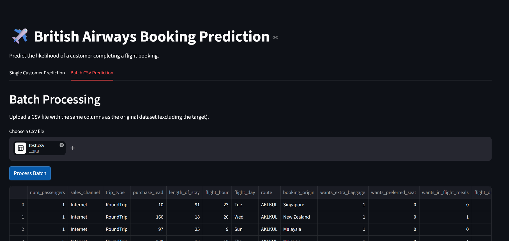

 # ✈️ British Airways Customer Booking Prediction using Machine Learning

Developed as part of the Virtual Data Science Internship associated with British Airways and DSTI - School of Engineering, this project focuses on predicting whether a customer will successfully complete a flight booking using Machine Learning techniques.

The application analyzes customer travel behavior, booking patterns, and trip-related information to estimate booking completion probability through an interactive prediction dashboard.

---

# 🚀 This Project Combines

- 📊 Data Analysis & Feature Engineering
- 🤖 Machine Learning Model Development
- ⚡ End-to-End Prediction Pipeline
- 🌐 Interactive Streamlit Dashboard
- 📈 Real-Time Customer Booking Prediction
- 💾 Model Serialization & Deployment

---

# 📌 Project Objective

The primary goal of this project is to build an intelligent Machine Learning system capable of predicting whether a customer will complete a flight booking.

This solution can help airlines:

- ✈️ Improve booking conversion rates
- 🎯 Optimize marketing strategies
- 📊 Understand customer booking behavior
- 🧠 Support data-driven business decisions
- 📈 Increase operational efficiency

---

# 📊 Dataset Information

The dataset contains airline customer booking records and travel-related information collected during the booking process.

## 📌 Features Included

- 👥 Number of Passengers  
- 💳 Sales Channel  
- ✈️ Trip Type  
- 📅 Purchase Lead (Days)  
- 🏨 Length of Stay (Days)  
- ⏰ Flight Hour  
- 📆 Flight Day  
- 🌍 Flight Duration (Hours)  
- 🛫 Route (e.g., AKLHND)  
- 🌎 Booking Origin (Country)  

## ✨ Extra Services

- 🧳 Extra Baggage  
- 💺 Preferred Seat  
- 🍱 In-flight Meals  
---

## 🎯 Target Variable

| Value | Meaning |
|---|---|
| 0 | ❌ Booking Not Completed |
| 1 | ✅ Booking Completed |

---

# 🏗️ Project Structure

```text
British-Airways-Booking-Prediction/
PROJECT_NAME/
│
├── data/
│   ├── ba_schedule.xlsx
│   └── customer_booking.csv
│
├── img/
│
├── models/
│   ├── best/
│   │   ├── ba_cat_boost_params.joblib
│   │   ├── ba_cat_boost_pipeline.joblib
│   │   └── ba_cat_boost.joblib
│   │
│   └── pipeline/
│       ├── preprocessing_cat_pipeline.joblib
│       └── preprocessing_pipeline.joblib
│
├── notebook/
│   ├── catboost_info/
│   ├── ba_customer_booking.ipynb
│   └── ba_tier.ipynb
│
├── src/
│   ├── preprocessing/
│   │   ├── __init__.py
│   │   ├── data_cleaning.py
│   │   ├── FeatureEngineer.py
│   │   ├── Pipeline.py
│   │   └── preprocessing.py
│   │
│   ├── training/
│   │   ├── __init__.py
│   │   ├── BaseTrainer.py
│   │   ├── CatBoostTrainer.py
│   │   ├── LogisticRegressionTrainer.py
│   │   ├── RandomForestTrainer.py
│   │   ├── Trainer.py
│   │   └── XGBoostTrainer.py
│   │
│   ├── testing/
│   │   ├── __init__.py
│   │   └── test_cat_boost.py
│   │
│   ├── ui/
│   │   └── app.py
│   │
│   ├── utils/
│   │   ├── __init__.py
│   │   ├── logger.py
│   │   └── train_test_split.py
│   │
│   └── __init__.py
│
├── config.yaml
├── requirements.txt
└── README.md
```

---

# ⚙️ Technologies Used

## 🧠 Machine Learning & Data Processing

- Python
- Pandas
- NumPy
- Scikit-learn
- CatBoost
- XGBoost
- Imbalanced-learn

---

## 📊 Data Visualization

- Matplotlib
- Seaborn

---

## 🌐 Application Development

- Streamlit

---

## 💾 Model Serialization

- Joblib

---

# 🧠 Machine Learning Workflow

## 🧹 1. Data Preprocessing

- Data cleaning
- Missing value handling
- Feature transformation
- Encoding categorical variables

---

## ⚙️ 2. Feature Engineering

Custom features were created to improve prediction performance, including:

- Flight period categorization
- Stay duration classification
- Booking behavior indicators
- Trip-type analysis

---

## 🤖 3. Model Development

Several advanced classification algorithms were tested, including:

- CatBoost Classifier
- XGBoost Classifier
- Ensemble-based models

---

## 📈 4. Model Evaluation

Evaluation metrics used:

- Accuracy Score
- Precision & Recall
- F1-Score
- ROC-AUC Score

---

## ⚡ 5. Pipeline Architecture

A scalable Scikit-learn pipeline was designed to integrate:

- Custom preprocessing transformers
- Feature engineering components
- Machine Learning models
- Automated prediction workflow

---

# 🚀 Application Features

## 🔹 Single Customer Prediction

Users can manually enter customer details and instantly receive a booking prediction result.

---

## 🔹 Batch Prediction

Users can upload CSV files containing multiple booking records to generate predictions for large datasets simultaneously.

---


# 🖼️ Application Screenshots


## 📌 Single Prediction Interface

<br>

<p align="center">
  
</p>

<br>

---

## 📌 Batch Prediction Interface

<br>

<p align="center">
  
</p>

<br>

---

# 🚀 How to Run the Project

## 📥 1. Clone the Repository

```bash
git clone https://github.com/your-username/british-airways-booking-prediction.git
```

---

## 📂 2. Navigate to the Project Directory

```bash
cd british-airways-booking-prediction
```

---

## 📦 3. Install Dependencies

```bash
pip install -r requirements.txt
```

---

## ⚙️ 4. Build the ML Pipeline

```bash
python src/preprocessing/pipeline.py
```

---

## ▶️ 5. Launch the Streamlit Application

```bash
streamlit run src/ui/app.py
```

---

# 🌐 Application Access

| 🌍 Service | 🔗 URL |
|---|---|
| 🏠 Streamlit Dashboard | http://localhost:8501 |

---

# 🔍 Prediction Workflow

```text
User enters customer booking details
                    ↓
Data preprocessing pipeline executes
                    ↓
Feature engineering transformations applied
                    ↓
Machine Learning model generates prediction
                    ↓
Booking completion probability displayed
```

---

# 💡 Future Improvements

- ☁️ Cloud deployment using AWS / Azure / Render
- 🔐 User authentication system
- 📱 Mobile-responsive UI improvements
- 🧠 Explainable AI integration
- 🐳 Docker containerization
- ⚙️ CI/CD pipeline implementation

---

# 👨‍💻 Author

## Royal Prince Alex John

📧 Email:
[royal-prince.alex-john@edu.dsti.institute](mailto:royal-prince.alex-john@edu.dsti.institute)

🔗 LinkedIn:
https://www.linkedin.com/in/royal-prince/

🔗 GitHub:
https://github.com/royalprince21/

---

# 📄 Disclaimer

This project was developed for educational purposes as part of a virtual internship experience. The dataset used in this project was publicly provided for academic learning and Machine Learning experimentation.

---
